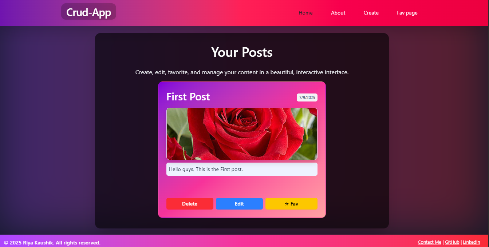

# Crud-App

Build a modern, feature-rich CRUD application with elegant gradients and seamless user experience.

## 🚀 Features
- ✍️ **Create, Edit & Delete Posts** - Fully functional content management with smooth interactions.
- 💖 **Favorite Posts** - Mark posts as favorites for quick access.
- 🖼 **Image Support** - Make posts visually appealing with images.
- 🎨 **Modern Gradient UI** - Eye-catching gradient themes and responsive layouts.
- 🌙 **Dark Mode Friendly** - Designed to look stunning even in dark environments.
- 🔥 **Smooth Animations** - Interactive hover and click effects for a lively experience.

## 📸 Preview


## 🛠 Built With
- **HTML5 & CSS3**
- **JavaScript (Vanilla / Framework as per project)**
- **Responsive Design**
- **Gradient & Shadow Styling**

## 📦 Getting Started
Clone the repository and run:

```bash
# Install dependencies
npm install

# Build for production
npm run build

# Or run development server
npm run dev

🚀 Deployment
Easily deploy on Vercel, Netlify, or Surge for lightning fast global delivery.

✍️ Author
Riya Kaushik

[github](https://github.com/riya1807pro)

[Linkedin](https://www.linkedin.com/in/riyakaushik-webdev)


📜 License
© 2025 Riya Kaushik. All rights reserved.